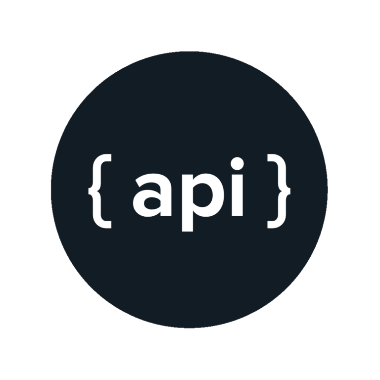

<h1 align="center">
    
    <br>Api do Petfood<br/>   
</h1>

## 💻 Projeto

**Api do Petfood** é uma aplicação de back-end desenvolvido em node para alimentar o sistema de petfood.

## 🚀 Tecnologias

- Node
- Axios
- Express
- Mongodb
- Mongoose

## ℹ️ Como Executar

- ### **Pré-requisitos**

  - É **necessário** possuir o **[Node.js](https://nodejs.org/en/)** instalado no computador

  - É **necessário** possuir o **[MongoDB](https://docs.mongodb.com/manual/installation)** instalado localmente

  - É **necessário** possuir o **[MongoDB Compass](https://www.mongodb.com/try/download/compass)**

  - Também, é **preciso** ter um gerenciador de pacotes seja o **[NPM](https://www.npmjs.com/)** ou **[Yarn](https://yarnpkg.com/)**.

1. Executando a Aplicação:

```sh

  # Instalando as dependências do projeto.
  $ yarn install # ou npm install

  # Antes de iniciar a api confirme se o mongodb esta rodando na sua maquina.

  # Execute o app
  $ yarn start # ou npm start

  # Execute o arquivo para inseri os dados no banco localmente

  # Obs: entre no diretório onde esta o arquivo e so depois execute o comando.

  $ node addPetshopAndProducts.js


```
